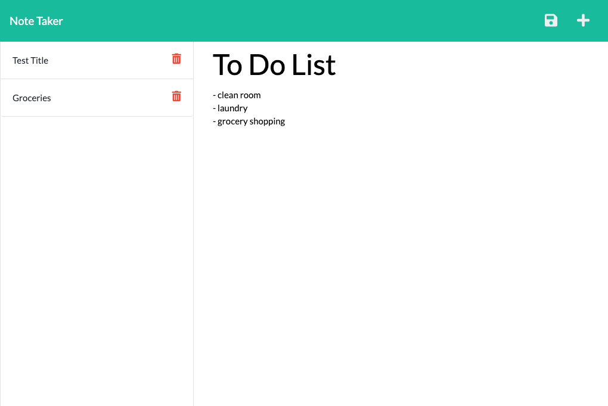

# note-taker


## by Charlotte Clark 


## How to Use

```
After opening the Note Taker, you will be presented with a landing page with a link to a notes page. 
If you click on the Notes Page button, you will be presented with a page with existing notes listed in the left-hand column. 
You will also see an empty field to the right to enter a new note title and the note’s text in the right-hand column.
You can enter a new note title and the note’s text, and a Save icon will in the navigation at the top of the page. 
If you would like to save the note, click the Save icon, and the note will appear in the left hand column in an existing note list. 
Click on the note to see it in full in the right column. 
If you would like to delete a note, click the trash can button. 
Click the "+" button to get an empty field to enter a new note.
```

[Deployed Link](https://secret-reaches-68242.herokuapp.com/)




